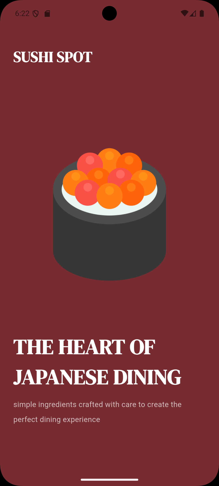
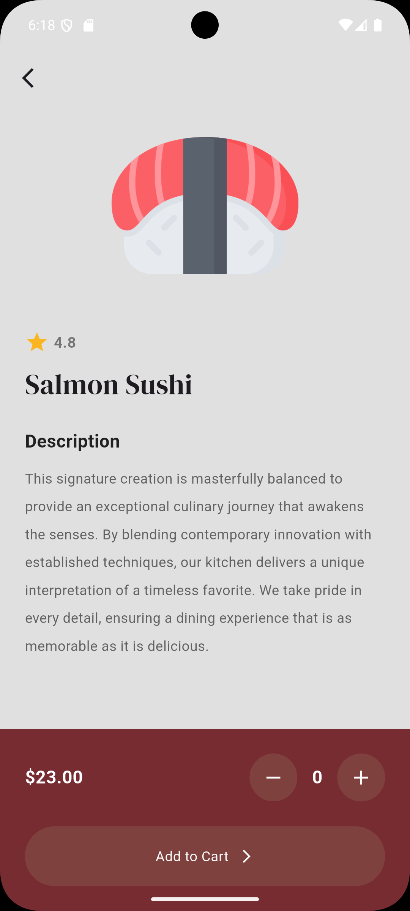
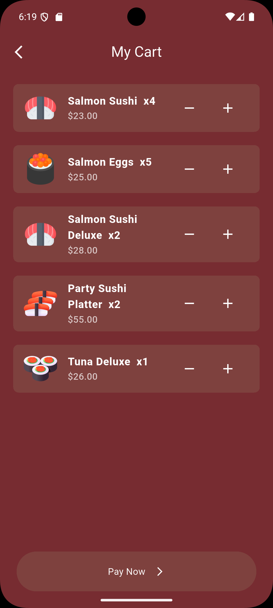

SushiShop

A Flutter-based food ordering module demonstrating clean UI composition, centralized state management using Provider, and a scalable cart system with quantity handling.

## Screenshots

| Splash | food details |
|--------|------|
|  |  |

| Menu | Cart |
|------|------|
|  |  |
